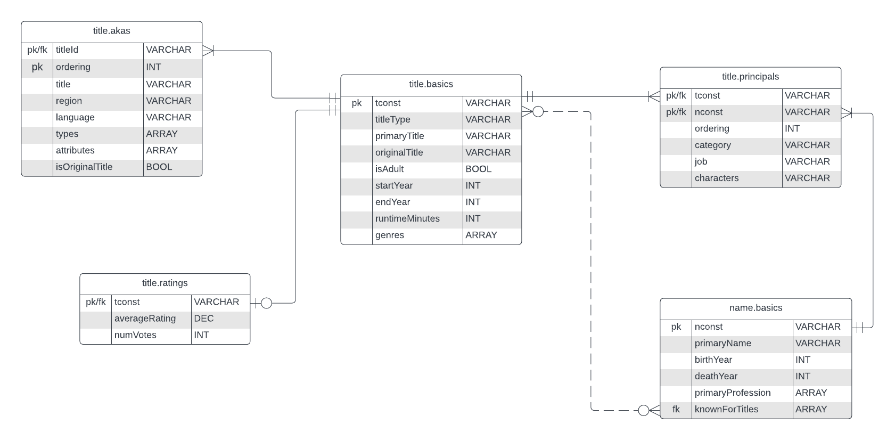
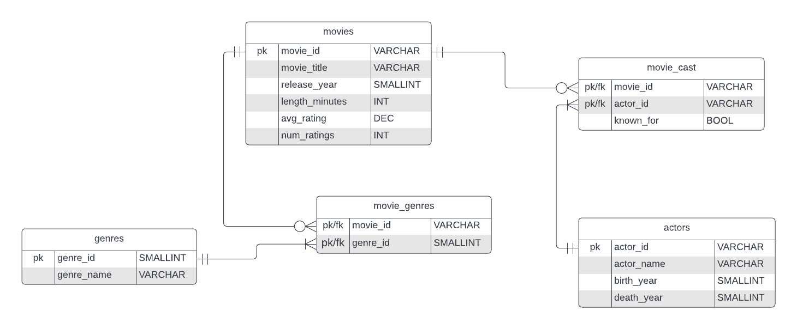

# imdb-analysis

## Introduction
In this project I will be extracting public movie data from the popular movie and tv show database IMDb. IMDb contains information related to movies, tv shows, actors, actresses, and other visual entertainment content. For the purpose of this project I will be focusing exclusively on data related to movies.

The [data related to IMDb](https://developer.imdb.com/non-commercial-datasets/) is publicaly available for non-commercial use on IMDb's website. In this project, I extracted, cleaned, and normalized this data and created a PostgreSQL database called "movies" to store this data locally. I then performed analysis to find trends in movie production, audience reception, and actor likeness.

---
## Process

### 1. Extracting, Cleaning, and Validating Raw Data with Python
   - Raw data was extracted from IMDb dataset, cleaned, and transformed into a format optimal for analysis of movie data.
### 2. Creating PostgreSQL database and loading cleaned data
   - After the data was properly transformed and normalized, a PostgreSQl database called `movies` was created for optimal storage and retrieval
### 3. Analyzing PostgeSQL database via SQL and Python
   - The newly created movies database was analyzed using SQL to extract the necessary data and Python to transform/visualize results

---
## Extracting, Cleaning, and Validating Raw Data with Python

The first step of this project involved extracted the datasets from IMDb, cleaning the data, and structuring the data in a format optimized for storage in a SQL database and analysis. Below is an abbrevated version of this process. To view the full process along with the Python code, see the [raw data cleaning file](raw_data_cleaning.ipynb).

### Raw Data ER Model

See the conceptual relational model of all the files extracted from IMDb. Note that this ER model is based on my interpretation and is unofficial.

#### Table Descriptions
- **title.basics**:Data related to all titles in IMDB database. Includes movies, tv show episodes, live action plays, etc.
- **name.basics**: Data related to all individuals who have participated in the production of a title. Includes actors/actresses, writers, directors, costume designers, etc.
- **title.principals**: Mapping table between the name.basics table and title.basics table. A record exists for every individual involved in a title.
- **title.ratings**: Contains the average rating and number of votes for records in the "titles" Table. This is a one-to-one optional relationship, meaning an individual title could have a max of one record in the "ratings" table, but could not have one as well. Since this is a one-to-one relationship, these two tables should be combined.
- **title.akas**: Contains all alternative titles for a local region/country for each unique record in "title.basics" table.

### Cleaning, Validation and Transformation Process
Though this data comes from a reputable source, thorough cleaning and validation was needed. The data contained in these files was cleaned and validated by filtering out non-movie related data, removing invalid data, and ensuring no duplicates where necessary. The data was also transformed by removing unnecessary columns, combining certain tables, and unnesting array data types using associative tables. To view the full process, see the [raw data cleaning notebook](raw_data_cleaning.ipynb)

### Transformed ER Model

See a visual representation of the structure of the transformed data. This also serves as the structure of the PostgreSQL database created in the next step.

#### Table Descriptions
- **movies**: Contains all movies in IMDb database and relevant information about each movie.
- **actors**: Stores information related to actors in movies.
- **movie_cast**: Mapping table between actors and movies tables identifying all actors in every movie.
- **genres**: Contains all distinct genres a movie can be tagged as.
- **movie_genres**: Mapping table between movies and genres table identifying all genres a movie has.
---
## Creating PostgreSQL database and Loading Cleaned Data

After the raw data was thoroughly cleaned and transformed, a PostgreSQL database called `movies` was created for storage. To view the SQL code, view the [database creation script](database_creation_script.sql). The cleaned data was then loaded into the movies database via sqlalchemy. See the this process in the [data loading notebook](data_loading.ipynb).

---
## Analyzing Movies Database via SQL and Python
